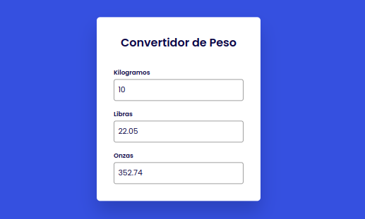

# Mini Proyecto de Convertidor de Unidades de Peso en JavaScript

## Descripción

Este es un mini proyecto de convertidor de unidades de peso creado con JavaScript. El proyecto ha sido creado con fines educativos para practicar el manejo de eventos y cálculos simples en JavaScript.

## Funcionalidad

Este convertidor permite al usuario convertir entre kilogramos (kg), libras (lb) y onzas (oz). Cuando el usuario introduce un valor en una de las cajas de texto, los otros dos campos se actualizan automáticamente con los equivalentes correspondientes en las otras unidades de peso.

## Prueba el Reloj

Para probar el convertidor, simplemente ve a la página de demostración alojada en GitHub Pages haciendo click en el siguiente enlace:

* https://pablospata.github.io/convertidor-peso-js/